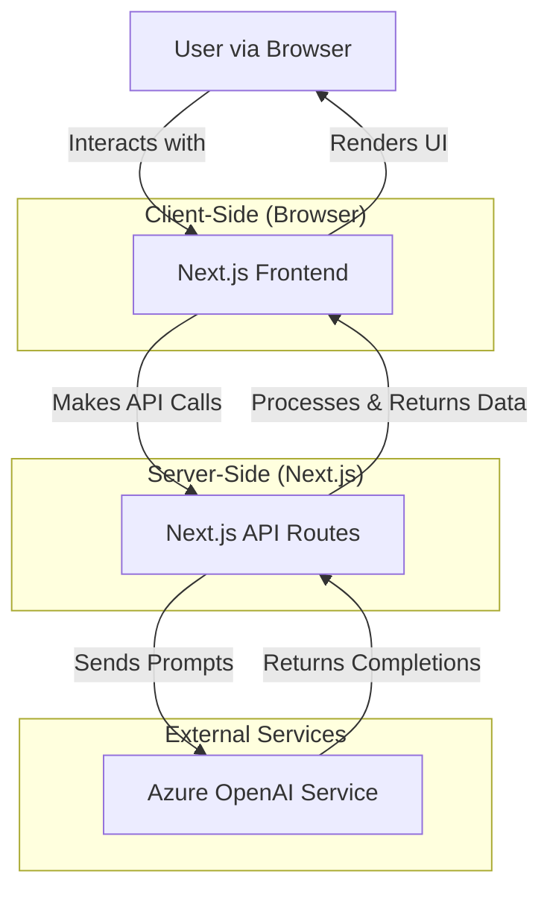

# AI Marketing Agent - Architecture Document

This document provides a detailed overview of the AI Marketing Agent's architecture, covering the frontend, backend (Next.js API routes), and interactions with external services.

## 1. Overall Architecture

The application follows a modern web architecture pattern with a Next.js frontend serving both the user interface and backend API routes. Azure OpenAI Service provides the core AI capabilities.

-   **User**: Interacts with the application through a web browser.
-   **Frontend (Next.js)**: Built with React 19 and Next.js 15 (App Router). Responsible for rendering the UI, managing client-side state, and making requests to the backend API routes. It heavily utilizes Server Components for performance and Client Components where interactivity is needed.
-   **API Routes (Next.js)**: Backend logic implemented as serverless functions within the Next.js framework. They handle business logic, data validation, and communication with the Azure OpenAI Service.
-   **Azure OpenAI Service**: The external AI service that processes prompts and returns generated content (ideas, strategies).

## 2. Frontend Architecture

The frontend is structured to promote modularity, reusability, and maintainability.

### 2.1. Directory Structure (`frontend/src`)

-   **`app/`**: Core of the Next.js App Router implementation.
    -   `layout.tsx`, `page.tsx`: Define the root layout and entry pages.
    -   `api/`: Contains subdirectories for each API route (e.g., `content-ideas/route.ts`).
    -   `dashboard/`: Contains the main user-facing page for interacting with the marketing agent wizard.
    -   Other directories represent routes and sub-routes.
-   **`components/`**: Contains all React components, organized by type or feature.
    -   `ui/`: Reusable, generic UI components, often wrappers around Shadcn UI elements or custom low-level UI elements.
    -   `wizard/`: Components specific to the multi-step campaign input wizard (e.g., `CampaignWizardForm.tsx`, `steps/`, `results/`).
    -   `providers/`: React Context providers for global or shared state (if any beyond what Next.js provides by default).
-   **`lib/`**: Utility functions, helper functions, type definitions, and constants shared across the frontend.
    -   `schemas.ts`: Zod schemas for client-side validation (if needed) or for type inference matching backend schemas.
    -   `utils.ts`: General utility functions.
-   **`hooks/`**: Custom React hooks for reusable component logic (e.g., `useWizardState.ts`).
-   **`types/`**: Shared TypeScript type definitions and interfaces used across the frontend.

### 2.2. Component Strategy

-   **React Server Components (RSC)**: Used by default for data fetching and rendering static or server-rendered content. This improves performance by reducing the amount of JavaScript sent to the client.
-   **Client Components (`'use client'`)**: Used for components that require interactivity, browser-only APIs, or manage state (e.g., forms, event handlers).
-   **Shadcn UI & Radix UI**: Leveraged for pre-built, accessible, and customizable UI primitives. Components are often composed from these libraries.
-   **Modularity**: Components are kept small and focused on a single responsibility.

### 2.3. State Management

-   **Local Component State**: `useState` and `useReducer` are used for managing state within individual components.
-   **Server Actions & `useActionState`**: For form submissions and mutations that interact with server-side logic, Next.js Server Actions are used. `useActionState` (React 19) is employed to handle pending/success/error states and optimistic updates for these actions.
-   **URL State (`nuqs`)**: Used for managing state that should be reflected in the URL, such as wizard step, filters, or search queries. This allows for shareable and bookmarkable URLs.
-   **React Context**: Used sparingly for global state that doesn't fit well into URL state or local state (e.g., theme, user authentication status if implemented).

### 2.4. Routing

-   **Next.js App Router**: File-system based routing is used. Directories within `app/` define routes.
-   **Layouts**: `layout.tsx` files are used to define shared UI structures for segments of the application.
-   **Loading UI & Error Boundaries**: `loading.tsx` and `error.tsx` files are used to handle loading states and runtime errors gracefully within route segments.

### 2.5. Styling

-   **Tailwind CSS**: Utility-first CSS framework for rapid UI development.
-   **Shadcn UI**: Provides beautifully designed components that are built on Tailwind CSS and Radix UI, ensuring consistency and accessibility.
-   **CSS Modules**: Used for component-scoped styles when necessary, though Tailwind CSS is the primary approach.

## 3. Backend Architecture (API Routes)

API routes are implemented within the `frontend/src/app/api/` directory.

### 3.1. API Design

-   **RESTful Principles**: API routes generally follow RESTful conventions (e.g., using POST for creating resources or initiating actions).
-   **Request/Response Schemas (Zod)**: Zod is used for robust input validation of request bodies and for defining the structure of responses. This ensures type safety and clear API contracts.
-   **Single Responsibility**: Each API route typically handles a specific action or resource (e.g., `/api/content-ideas`, `/api/generate-strategy`).

### 3.2. AI Integration (Azure OpenAI)

-   **`openai` SDK**: The official Node.js SDK for OpenAI is used to interact with the Azure OpenAI Service.
-   **`AzureOpenAI` Client**: The `AzureOpenAI` class from the SDK is initialized with Azure-specific credentials (API key, endpoint, API version) stored in environment variables.
-   **Prompt Engineering**: Carefully crafted prompts are constructed within each API route based on the validated user input. These prompts guide the AI to generate the desired output in the correct format (e.g., JSON).
-   **Response Parsing**: The AI's response (typically JSON) is parsed and validated before being sent back to the client. Error handling is in place for parsing failures.
-   **Model Selection**: The specific Azure OpenAI deployment name (model) is used in the API calls (e.g., `gpt-4.1` or an environment variable like `AZURE_OPENAI_DEPLOYMENT_NAME`).

### 3.3. Error Handling

-   **Input Validation Errors**: If request validation using Zod fails, a 400 Bad Request response is returned with details of the validation errors.
-   **AI Service Errors**: Errors from the Azure OpenAI service (e.g., API errors, model unavailability) are caught and typically result in a 500 Internal Server Error, with console logging for debugging.
-   **Parsing Errors**: If the AI response is not in the expected JSON format, this is caught, logged, and a 500 error is returned.
-   **General Errors**: Generic `try...catch` blocks are used to handle unexpected errors, logging them server-side and returning appropriate error responses to the client.

### 3.4. Security

-   **Environment Variables**: Sensitive credentials like API keys and endpoints are stored in environment variables (`.env.local`) and are not committed to version control.
-   **Input Sanitization/Validation**: Zod validation helps prevent common injection vulnerabilities by ensuring inputs conform to expected types and structures.
-   **(Future Considerations)**: Rate limiting (e.g., with Upstash Ratelimit if needed), authentication/authorization for protected endpoints.

## 4. Data Flow Examples

### 4.1. Generating Content Ideas

1.  User fills out the campaign wizard form in the frontend (`dashboard/page.tsx`).
2.  On submit, client-side validation (if any) occurs.
3.  A `POST` request is made to `/api/content-ideas` with the form data in the request body.
4.  The `content-ideas/route.ts` handler validates the request body using its Zod schema.
5.  If valid, a prompt is constructed using the input data.
6.  The `AzureOpenAI` client sends the prompt to the configured Azure OpenAI model.
7.  Azure OpenAI returns a completion (expected to be a JSON string).
8.  The API route parses the JSON string.
9.  If parsing is successful, the parsed data (array of `ContentIdeaBlock`) is returned to the frontend with a 200 OK status.
10. The frontend receives the data and updates the UI to display the content ideas.

### 4.2. Generating Marketing Strategy

(Similar flow to content ideas, but targets the `/api/generate-strategy` endpoint and uses a different prompt and response structure.)

## 5. Key Libraries and Their Roles

-   **Next.js**: Full-stack React framework providing routing, server-side rendering, API routes, and build optimizations.
-   **React**: JavaScript library for building user interfaces.
-   **TypeScript**: Superset of JavaScript adding static typing for improved code quality and maintainability.
-   **Shadcn UI**: Collection of beautifully designed, accessible UI components built with Radix UI and Tailwind CSS.
-   **Radix UI**: Provides unstyled, accessible UI primitives for building design systems.
-   **Tailwind CSS**: Utility-first CSS framework for rapid UI development.
-   **Zod**: TypeScript-first schema declaration and validation library, used for API request/response validation.
-   **`openai` (Node.js SDK)**: Official library for interacting with OpenAI and Azure OpenAI services.
-   **`nuqs`**: Library for managing URL state in Next.js applications.

## 6. Future Considerations & Potential Improvements

-   **Database Integration**: For persisting user data, campaign inputs, and generated content.
-   **User Authentication**: To allow users to save and manage their marketing campaigns.
-   **More Sophisticated State Management**: If complexity grows, consider more advanced global state solutions like Zustand or Jotai.
-   **Job Queues for Long-Running AI Tasks**: If AI generation takes too long, offload to background jobs.
-   **Comprehensive Testing**: Unit, integration, and end-to-end tests for all critical parts of the application.
-   **CI/CD Pipeline**: Automated building, testing, and deployment. 